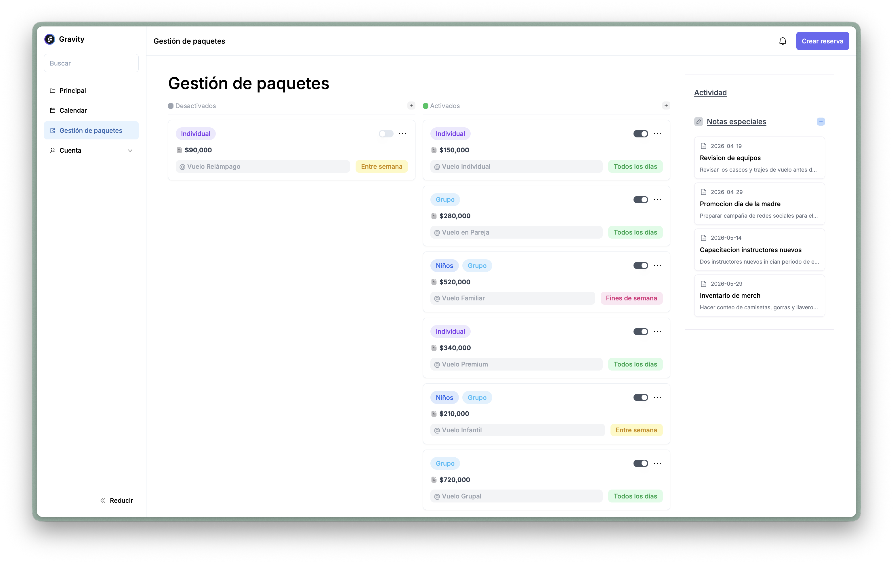

# Gravity

**Live demo:** https://gravity-web-app-three.vercel.app/

Gravity is the web application built for Colombia's first wind tunnel indoor skydiving experience, located in Bogota. It features a public landing page, an appointment and booking system with online payments, and an internal backoffice for managing packages, schedules, clients, and notes.

This project was originally developed as a freelance engagement. After the project was cancelled near the end of its development cycle, I acquired full ownership of the source code and intellectual property rights. I decided to publish it as a portfolio piece that demonstrates the kind of architecture, tech decisions, and programming patterns I was capable of delivering as a full-stack developer in 2024.

The application was built with little to no AI assistance. My goal at the time was to deeply learn and internalize **tRPC** as the core communication layer, making it the primary technical bet alongside Next.js for the entire stack. Every pattern in this codebase reflects hands-on learning and deliberate decision-making.

## Screenshots

| General dashboard (revenue, recent bookings, monthly chart) | Appointments list (sortable, filterable, XLSX export) |
| :---: | :---: |
|  |  |

| Calendar (monthly view of confirmed appointments) | Packages manager (CRUD for flight packages) |
| :---: | :---: |
|  |  |

The backoffice is accessed at `/bo` after authenticating through NextAuth. Every view above pulls its data through typed tRPC procedures — so the same table or chart that renders in the browser is backed by a schema defined once in Drizzle and validated once in Zod.

## Stack

### Core
- **[Next.js 14](https://nextjs.org/)** (App Router) — server-side rendering, file-based routing, and API route that hosts the tRPC handler. Turbo dev mode (`next dev --turbo`).
- **[React 18](https://react.dev/)** + **TypeScript** — end-to-end type safety from the database row to the rendered component.
- **[Tailwind CSS](https://tailwindcss.com/)** — utility styling, with `tailwindcss-animate` and `@designbycode/tailwindcss-text-stroke` extensions.

### API layer
- **[tRPC 11](https://trpc.io/)** (`@trpc/server`, `@trpc/client`, `@trpc/react-query`) — fully typed client/server communication with zero codegen. Routers live in `src/server/api/routers/` and are composed in `src/server/api/root.ts`. The React client is wired in `src/trpc/`.
- **[TanStack Query 5](https://tanstack.com/query)** — cache and request lifecycle for every tRPC hook.
- **[SuperJSON](https://github.com/blitz-js/superjson)** — transparent serialization of `Date`, `Map`, `BigInt` etc. across the wire.

### Data layer
- **[Drizzle ORM](https://orm.drizzle.team/)** + **PostgreSQL** (via `@vercel/postgres` / `postgres`). Schema defined in TypeScript under `src/server/db/schemas/`; migrations driven by `drizzle-kit`.
- **[drizzle-zod](https://orm.drizzle.team/docs/zod)** — insert/update Zod schemas derived directly from table definitions, so the DB column is the single source of truth up to the form validator.

### Auth
- **[NextAuth.js](https://next-auth.js.org/)** with the Drizzle adapter (`@auth/drizzle-adapter`) — Google and Discord providers. The session is injected into tRPC's context so every procedure can gate on authentication.

### State
- **[Zustand](https://zustand-demo.pmnd.rs/)** — lightweight client state for the booking cart, loaded packages, and calendar selections. Slices live in `src/lib/features/slices/`, composed in `src/lib/features/store.ts`. Zustand stores hydrate from tRPC query results; server state and client state stay cleanly separated.

### UI / styling
- **[Radix UI](https://www.radix-ui.com/)** + **[shadcn/ui](https://ui.shadcn.com/)** — accessible dialog, select, accordion, popover, dropdown, toast, and form primitives (`components.json`).
- **[GSAP](https://gsap.com/)** + `@gsap/react` — scroll-driven hero parallax, opinions carousel, and infinite gallery loop. Animations initialize inside `useEffect` hooks scoped to refs to avoid conflicts with React's render cycle. Full intended experience targets `xl` (≥1280px); smaller viewports receive a reduced animation set.
- **[react-big-calendar](https://jquense.github.io/react-big-calendar/)** for the backoffice calendar, **[TanStack Table](https://tanstack.com/table)** for the appointments list, **[Chart.js](https://www.chartjs.org/)** + `react-chartjs-2` for the monthly revenue chart.
- **[Phosphor Icons](https://phosphoricons.com/)** + **[Lucide](https://lucide.dev/)**.

### Forms & validation
- **[React Hook Form](https://react-hook-form.com/)** + **[Zod](https://zod.dev/)** via `@hookform/resolvers`. Spanish error messages through `zod-i18n-map` + `i18next` (`src/lib/zod_lang.tsx`).

### Payments & email
- **Bold** — Colombian online payment processor for the checkout flow.
- **[React Email](https://react.email/)** + **[Resend](https://resend.com/)** — transactional email templates (`src/emails/`) sent from a server action (`src/server/actions/sendEmail.ts`).
- **[xlsx](https://sheetjs.com/)** — client-side export of the appointments table.

### Tooling
- **ESLint** (`eslint-config-next`, `eslint-plugin-drizzle`), **Prettier** (`prettier-plugin-tailwindcss`).
- **drizzle-kit** for generate/push/migrate/studio.
- **drizzle-dbml-generator** for DBML diagrams from the schema.

## How the pieces connect

```
              ┌────────────────────────────────────────┐
              │       Browser (Next.js App Router)     │
              │  ┌──────────────────────────────────┐  │
              │  │  Landing  │  Checkout  │   /bo   │  │
              │  │  (GSAP)   │            │(backoff)│  │
              │  └──────────────────────────────────┘  │
              │     React + Zustand + TanStack Query   │
              └────────────────────┬───────────────────┘
                                   │  typed tRPC calls
                                   ▼
              ┌────────────────────────────────────────┐
              │   tRPC Router  (Next.js API route)     │
              │   ctx: { session (NextAuth), db }      │
              └────────────────────┬───────────────────┘
                                   │  Drizzle queries
                                   ▼
              ┌────────────────────────────────────────┐
              │              PostgreSQL                │
              └────────────────────────────────────────┘
                      ▲                       ▲
                      │                       │
              ┌───────┴────────┐     ┌────────┴────────┐
              │  Bold payments │     │ Resend + React  │
              │   (checkout)   │     │  Email (tx mail)│
              └────────────────┘     └─────────────────┘
```

- **tRPC** is the backbone. Every piece of data moving between client and server flows through a typed procedure — the TypeScript compiler catches mismatches at build time, not runtime.
- **Drizzle** schemas in `src/server/db/schemas/` double as the source for `drizzle-zod` validators, so the DB column drives both backend input validation and frontend form schemas.
- **NextAuth** protects the `/bo` routes and exposes the session to the tRPC context; every procedure can gate on auth without extra wiring.
- **Zustand** holds ephemeral UI state (cart, calendar selection, loaded packages) hydrated from tRPC results, keeping server and client state cleanly separated.
- **GSAP** animates the landing page from `useEffect`-scoped refs, avoiding collisions with React's render cycle.

## Project layout

```
src/
├── app/                              # Next.js App Router
│   ├── layout.tsx
│   ├── page.tsx                      # Landing entry
│   ├── sections/                     # Hero, packages, opinions, gallery (GSAP)
│   ├── auth/                         # Login page
│   ├── checkout/                     # Payment flow (Bold)
│   ├── bo/                           # Backoffice
│   │   ├── layout.tsx
│   │   ├── dashboard/
│   │   ├── calendar/
│   │   ├── packages/
│   │   └── components/
│   └── api/                          # tRPC + NextAuth handlers
├── server/
│   ├── api/
│   │   ├── root.ts                   # Router composition
│   │   ├── trpc.ts                   # Context + middlewares
│   │   └── routers/                  # Per-domain procedures
│   ├── db/
│   │   ├── index.ts                  # Drizzle client
│   │   ├── schemas/                  # Table definitions
│   │   └── utils.ts
│   ├── actions/                      # Server actions (email, redirects)
│   └── auth.ts                       # NextAuth config
├── trpc/                             # tRPC React client + server caller
├── lib/
│   ├── routes.ts                     # Typed route builder
│   ├── keys.ts                       # Query keys / storage keys
│   ├── regex.ts
│   ├── zod_lang.tsx                  # Spanish Zod messages
│   ├── features/
│   │   ├── store.ts                  # Zustand root store
│   │   └── slices/                   # Cart, packages, appointments slices
│   └── hooks/                        # useHeroAnimations, useBasicCarousel, …
├── components/                       # Shared UI (Radix + shadcn/ui)
├── emails/                           # React Email templates
├── types/
├── styles/
└── env.js                            # @t3-oss/env-nextjs schema
```

The split between `app/` (route-tied views) and `components/` (reusable, route-agnostic UI) mirrors the convention I use on other React projects — only the routing shell changes with the target.

## Scripts

```bash
bun run dev          # next dev --turbo
bun run build        # next build
bun run start        # next start
bun run lint         # ESLint
bun run format       # Prettier

bun run db:generate  # drizzle-kit generate (SQL migrations)
bun run db:migrate   # drizzle-kit migrate
bun run db:push      # drizzle-kit push  (dev: sync schema directly)
bun run db:studio    # drizzle-kit studio

bun run email        # React Email dev server (src/emails)
```

## Dummy data

The database is populated with placeholder data for demonstration purposes. SQL seed scripts live in:

```
scripts/seed/
├── 01_images.sql                   # Gallery, IG posts, profile pictures
├── 02_packages.sql                 # Wind tunnel flight packages
├── 03_opinions.sql                 # Client testimonials (depends on 01)
├── 04_hours.sql                    # Available time slots
├── 05_disabled_days.sql            # Blocked dates (holidays, maintenance)
├── 06_notes.sql                    # Internal backoffice notes
└── 07_bookings_and_services.sql    # Bookings, services, confirmations (depends on 02, 04)
```

Run them in order. Scripts `03` and `07` have foreign-key dependencies on earlier scripts.

## Live demo and local setup

The hosted deployment showcases the **landing page and frontend** only. Backend features — backoffice dashboard, appointment management, payment flow — are not functional in the hosted version.

To explore those features locally:

1. Clone the repo.
2. Copy `.env.example` to `.env` and fill in the required values (database connection, auth provider credentials, Bold payment keys, Resend API key).
3. Install dependencies: `bun install`.
4. Push the schema to your database: `bun run db:push`.
5. Run the seed scripts against your PostgreSQL instance (in order).
6. Start the dev server: `bun run dev`.
