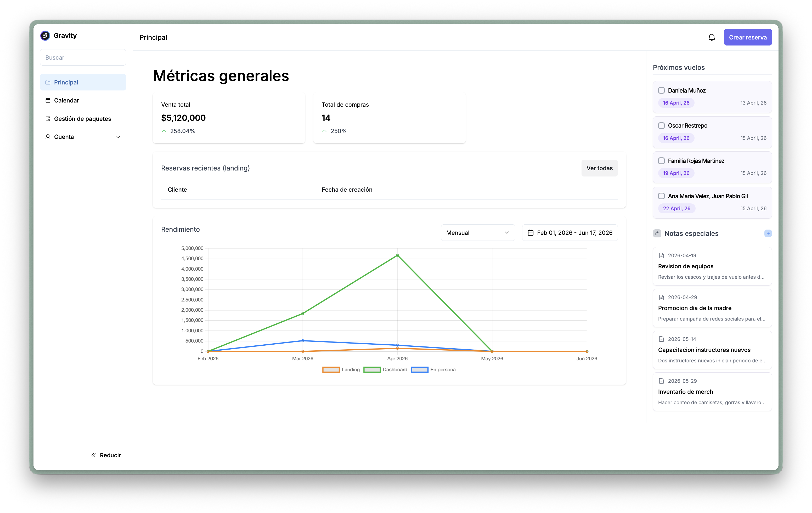
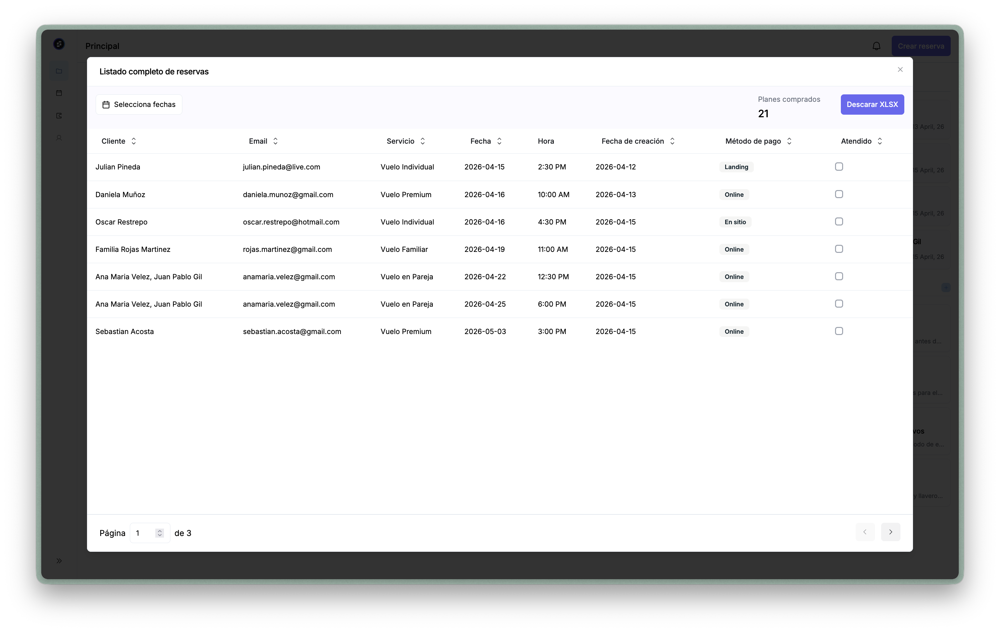
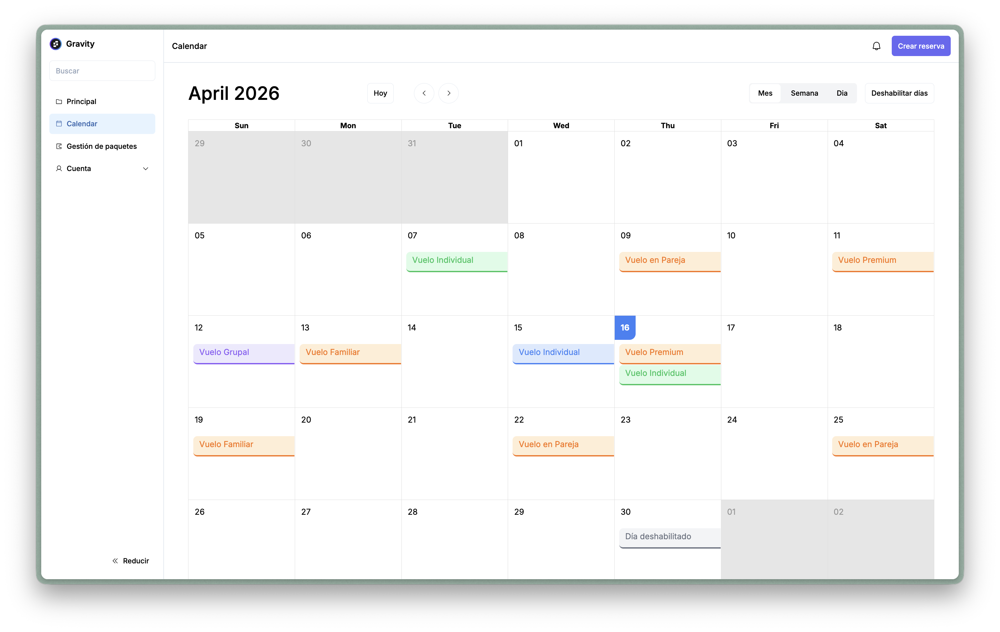

# Gravity

**Live demo:** https://gravity-web-app-three.vercel.app/

Gravity is the web application built for Colombia's first wind tunnel indoor skydiving experience, located in Bogota. It features a public landing page, an appointment and booking system with online payments, and an internal backoffice for managing packages, schedules, clients, and notes.

## Background

This project was originally developed as a freelance engagement. After the project was cancelled near the end of its development cycle, I acquired full ownership of the source code and intellectual property rights. I decided to publish it as a portfolio piece that demonstrates the kind of architecture, tech decisions, and programming patterns I was capable of delivering as a full-stack developer in 2024.

The application was built with little to no AI assistance. My goal at the time was to deeply learn and internalize **tRPC** as the core communication layer, making it the primary technical bet alongside Next.js for the entire stack. Every pattern in this codebase reflects hands-on learning and deliberate decision-making.

## Tech stack

| Layer | Tool | Role |
|---|---|---|
| Framework | **Next.js 14** (App Router) | Server-side rendering, routing, API layer |
| Language | **TypeScript** | End-to-end type safety across client and server |
| UI | **React 18** + **Tailwind CSS** | Component model and utility-first styling |
| API | **tRPC** | Fully typed client-server communication with zero code generation |
| Database | **Drizzle ORM** + PostgreSQL | Type-safe schema definition, queries, and migrations |
| Auth | **NextAuth.js** | Session management with Google and Discord providers |
| State | **Zustand** | Lightweight client-side state (cart, packages, appointments) |
| Animations | **GSAP** | Scroll-driven animations, carousels, and hero transitions |
| Payments | **Bold** | Online payment processing (Colombian provider) |
| Email | **React Email** + **Resend** | Transactional email templates and delivery |
| UI primitives | **Radix UI** + **shadcn/ui** | Accessible, composable dialog, select, accordion, and form components |

## How it all connects

```
Browser (React + Zustand + GSAP)
   |
   |  typed procedure calls
   v
tRPC Router (Next.js API route)
   |
   |  Drizzle queries
   v
PostgreSQL
```

**tRPC** is the backbone. Every piece of data that moves between the client and the server flows through typed tRPC procedures, which means the TypeScript compiler catches mismatches between what the frontend expects and what the backend returns at build time rather than at runtime.

**Drizzle** defines the database schema in TypeScript files (`src/server/db/schemas/`), and those same schema objects are used to build queries. Combined with **drizzle-zod**, the insert and update validations are generated directly from the table definitions, so the schema is the single source of truth from the database column all the way up to the form validation in the browser.

**Zustand** stores manage ephemeral client state (the booking cart, the loaded packages list, calendar selections) and are hydrated from tRPC query results on page load. This keeps server state and client state cleanly separated.

**GSAP** powers the landing page experience: the hero section parallax, the opinions carousel with scroll-to animations, and the infinite gallery loop. Animations are initialized inside React `useEffect` hooks and scoped to refs to avoid conflicts with React's rendering cycle. **Note: the full intended animation experience is designed for screens 1280px wide or wider (`xl` breakpoint). Smaller viewports are fully functional but receive a reduced version of the animations.**

**NextAuth** protects the backoffice routes and exposes the session to tRPC's context, so every procedure can check authentication and authorization without extra wiring.

## Dummy data

The database is populated with placeholder data for demonstration purposes. The SQL seed scripts are located in:

```
scripts/seed/
  01_images.sql                    # Gallery, IG posts, profile pictures
  02_packages.sql                  # Wind tunnel flight packages
  03_opinions.sql                  # Client testimonials (depends on 01)
  04_hours.sql                     # Available time slots
  05_disabled_days.sql             # Blocked dates (holidays, maintenance)
  06_notes.sql                     # Internal backoffice notes
  07_bookings_and_services.sql     # Bookings, services, confirmations (depends on 02, 04)
```

Run them in order. Scripts `03` and `07` have foreign key dependencies on earlier scripts.

## Live demo and local setup

There is a live deployment that showcases the **landing page and frontend** only. Backend features like the backoffice dashboard, appointment management, and payment flow are not functional in the hosted version.

To explore those features locally:

1. Clone the repo
2. Copy `.env.example` to `.env` and fill in the required values (database connection, auth provider credentials, Bold payment keys, Resend API key)
3. Install dependencies: `bun install`
4. Push the schema to your database: `bun run db:push`
5. Run the seed scripts against your PostgreSQL instance
6. Start the dev server: `bun run dev`

## Backoffice

### General dashboard



The main view after logging in. Displays total revenue and booking count with percentage indicators, a list of recent reservations made from the landing page, upcoming flights with their scheduled dates, and a monthly performance chart that breaks down revenue by source (landing page, backoffice dashboard, and on-site). The right sidebar shows active internal notes.

### Appointments list



Accessed from the "Ver todas" button on the dashboard. A paginated, sortable table of all reservations showing client name, email, package type, scheduled date and time, creation date, payment method, and attendance status. Includes a date range filter and an export-to-XLSX button for downloading the full dataset.

### Calendar



Monthly calendar view of all confirmed appointments. Each event is color-coded by package type and shows the package name directly on the cell. Supports month, week, and day views. Disabled days (holidays, maintenance) appear grayed out. Clicking a date opens a dialog to create a new booking for that day.

### Packages manager


Full CRUD interface for flight packages. Active and deactivated packages are separated into distinct columns. Each card shows the price, package name, category tags (Individual, Group, Children), availability window, and a toggle to activate or deactivate. The three-dot menu on each card provides edit and delete options. The activity sidebar on the right displays the same internal notes visible from the dashboard.

## Project structure

```
src/
  app/              # Next.js App Router pages and layouts
    bo/             # Backoffice (dashboard, calendar, packages management)
    checkout/       # Payment flow
    sections/       # Landing page sections (hero, packages, opinions, gallery)
    auth/           # Login page
  server/
    api/            # tRPC router definitions
    db/             # Drizzle schemas, connection, and utilities
    actions/        # Server actions (email, redirects)
  lib/
    features/       # Zustand slices and store
    hooks/          # Custom React hooks (carousel, animations, resize)
  components/       # Shared UI components
  types/            # TypeScript type declarations
```
